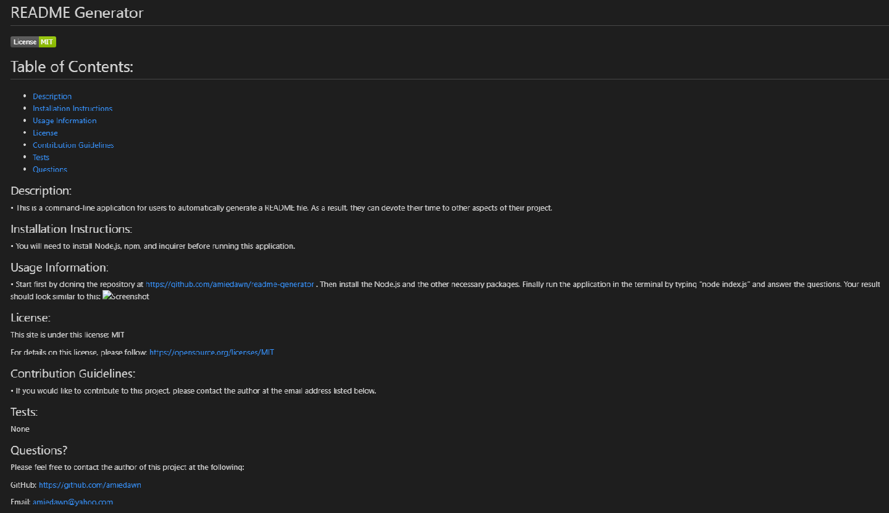

# README Generator

# Table of Contents:
* [Description](#description)
* [Installation Instructions](#installation-instructions)
* [Usage Information](#usage-information)
* [License](#license)
* [Contribution Guidelines](#contribution-guidelines)
* [Tests](#tests)
* [Questions](#questions)

## Description: 

This is a command-line application for users to automatically generate a README file. As a result, they can devote their time to other aspects of their project.

## Installation Instructions:

You will need to install Node.js, npm, and inquirer before running this application. 

## Usage Information:

Start first by cloning the repository at https://github.com/amiedawn/readme-generator . Then install the Node.js and the other necessary packages. Finally run the application in the terminal by typing “node index.js” and answer the questions. Your result should look similar to this: 

## License:

This site is under this license: MIT

For details on this license, please follow: https://opensource.org/licenses/MIT

## Contribution Guidelines:

If you would like to contribute to this project, please contact the author at the email address listed below.

## Tests:

None

## Questions?

Please feel free to contact the author of this project at the following:

GitHub: <https://github.com/amiedawn>

Email:  <amiedawn@yahoo.com>
